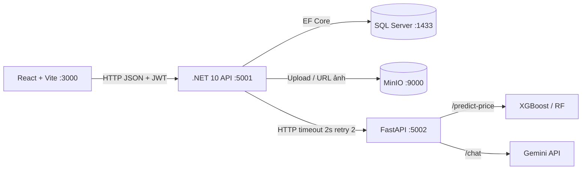

# Car Rental AI — Hệ thống Cho thuê Xe Thông minh

> Tối ưu giá thuê & tư vấn đặt xe bằng AI · Đồ án Chuyên đề tổng hợp .NET + DevOps + AI (10 tuần)

[](https://dotnet.microsoft.com)
[](https://vitejs.dev)
[](https://fastapi.tiangolo.com)
[](https://www.microsoft.com/sql-server)
[](https://docs.docker.com/compose/)

## Tổng quan

Khách chọn xe, chọn ngày thuê → hệ thống gọi AI dự đoán giá tối ưu theo mùa, loại xe, thời hạn thuê; đồng thời chatbot tư vấn xe phù hợp. Nếu AI lỗi hoặc quá 2 giây không phản hồi, hệ thống tự fallback về giá niêm yết và đánh dấu `IsFallback = true` — người dùng không bao giờ bị chặn đặt xe.

| Thành phần | Công nghệ | Port |
|---|---|---|
| Backend | .NET 10, Clean Architecture + Modular Monolith | 5001 |
| AI Service | FastAPI (Python), XGBoost / Random Forest + Gemini, chạy độc lập ngoài monolith | 5002 |
| Frontend | React + Vite (phục vụ qua nginx) | 3000 |
| Database | SQL Server 2022 | 1433 |
| Object Storage | MinIO — lưu ảnh xe, chỉ nhận WebP | 9000 (API), 9001 (console) |

## Trạng thái hiện tại

| Hạng mục | Trạng thái |
|---|---|
| Auth (đăng ký, đăng nhập JWT, phân quyền Customer/Staff/Admin) | Đã có |
| Quản lý xe (CRUD, lọc, phân trang, ảnh WebP lên MinIO) | Đã có |
| Đặt xe (chống trùng lịch, xem/xác nhận/hủy) | Đã có, đã chạy thử qua Docker |
| Gọi AI định giá (timeout 2s, retry 2, fallback) | Client đã có; FastAPI mới là stub, chưa có model thật |
| Thanh toán, nhận/trả xe, hợp đồng PDF | Chưa có API |
| Chatbot Gemini, báo cáo doanh thu | Chưa làm |

Kế hoạch chi tiết từng tuần: [docs/weekly-plan.md](docs/weekly-plan.md) và [docs/scrum-jira-backlog.md](docs/scrum-jira-backlog.md).

## Kiến trúc

**Nhãn ngắn:** Clean Architecture, Modular Monolith · **Khung 3 cột:** 1.2 Clean/Onion + 2.4 Client-Server (backend là 2.2 Modular Monolith) + 3.1 Request-Response



- Code: Clean Architecture 5 project, bên trong Domain/Application chia module Cars / Bookings / Customers.
- Hệ thống: Client-Server — React là client, .NET API và FastAPI là server.
- Tích hợp .NET ↔ AI: Request-Response đồng bộ (HTTP), không dùng queue/broker — xem [docs/decisions.md](docs/decisions.md) (ADR-003).

Chi tiết: [docs/architecture.md](docs/architecture.md)

## Công nghệ

| Lớp | Tech | Ghi chú |
|---|---|---|
| Backend | .NET 10, EF Core, JWT | Clean Arch 5 project, Modular Monolith |
| AI | FastAPI, XGBoost/RF, Gemini | 3 endpoint: `/health`, `/predict-price`, `/chat` |
| Frontend | React + Vite | Gọi API qua JWT |
| DB | SQL Server | 6 bảng: Customer, Car, CarImage, Booking, Payment, ReturnRecord |
| Lưu trữ | MinIO | Bucket `car-rental`, ảnh xe định dạng WebP |
| DevOps | Docker Compose, GitHub Actions | CI build và test trên PR; CD dự kiến Railway/Render |

## Cấu trúc repo

```
CarRental.slnx
├── src/CarRental.Domain/           # Module: Cars / Bookings / Customers / Common
├── src/CarRental.Application/      # Module: Cars / Bookings / Customers
├── src/CarRental.Infrastructure/   # EF Core, MinIO, HttpClient gọi AI
├── src/CarRental.API/              # Composition root, Controllers
├── tests/CarRental.Tests/
├── ai-service/                     # FastAPI — service độc lập (Năng)
├── frontend/                       # React + Vite (Việt Anh)
├── docs/
│   ├── api-contract.md
│   ├── architecture.md
│   ├── decisions.md
│   ├── erd.dbml
│   ├── weekly-plan.md
│   └── scrum-jira-backlog.md
├── .github/workflows/ci.yml
├── .env.example
└── docker-compose.yml
```

Quy tắc: Domain không tham chiếu gì. Application chỉ tham chiếu Domain. Mỗi module nghiệp vụ nằm trong folder `Modules/<TênModule>` — chỉ là quy ước đặt folder.

## Phân công

| TV | Họ tên | Vai trò |
|---|---|---|
| A | Nguyễn Vũ Dũng (nhóm trưởng) | Kiến trúc, ERD, API contract, board, review PR |
| B | Đỗ Anh Tuấn | Backend nghiệp vụ (Auth, Car, Booking, Payment, PDF) |
| C | Nguyễn Minh Năng | AI Service FastAPI |
| D | Lê Việt Anh | Frontend React |
| E | Vũ Duy Tiến | Docker Compose, CI/CD, deploy |

## Bắt đầu nhanh

Yêu cầu: Docker Desktop. Chạy backend riêng cần thêm .NET 10 SDK.

```bash
git clone https://github.com/nguyenvudung365-commits/car-rental-ai.git
cd car-rental-ai

# Tạo file môi trường rồi điền giá trị thật (không commit .env)
cp .env.example .env

# Chạy full stack
docker compose up --build
```

Ở môi trường Development, API tự áp migration khi khởi động nên không cần chạy `dotnet ef` thủ công.

Chạy backend riêng (cần SQL Server đang chạy và `ConnectionStrings__Default` trỏ tới đó):

```bash
dotnet build CarRental.slnx
dotnet run --project src/CarRental.API
```

| Dịch vụ | Địa chỉ |
|---|---|
| Frontend | http://localhost:3000 |
| API health | http://localhost:5001/health |
| OpenAPI JSON (Development) | http://localhost:5001/openapi/v1.json |
| AI Service docs | http://localhost:5002/docs |
| MinIO console | http://localhost:9001 |

### Biến môi trường

Khai báo trong `.env` (không commit). Mẫu đầy đủ ở [.env.example](.env.example).

| Biến | Ý nghĩa |
|---|---|
| `DB_NAME`, `DB_USER`, `DB_PASSWORD` | Kết nối SQL Server |
| `JWT_KEY` | Khóa ký JWT, tối thiểu 32 ký tự |
| `GEMINI_API_KEY` | Khóa Gemini cho chatbot |
| `AI_TIMEOUT_SECONDS`, `AI_RETRY_COUNT` | Timeout và số lần retry khi gọi AI (mặc định 2 và 2) |
| `MINIO_ACCESS_KEY`, `MINIO_SECRET_KEY`, `MINIO_BUCKET` | Truy cập MinIO |
| `MINIO_PUBLIC_URL` | URL công khai của ảnh, phải khớp port ngoài của MinIO |
| `MINIO_HOST_PORT`, `MINIO_CONSOLE_PORT` | Port MinIO trên máy host (mặc định 9000 và 9001) |

### Lỗi thường gặp

- **Port 9000/9001 đã bị chiếm** (ví dụ container MinIO của dự án khác): đặt `MINIO_HOST_PORT=9100`, `MINIO_CONSOLE_PORT=9101` và `MINIO_PUBLIC_URL=http://localhost:9100` trong `.env`.
- **`npm run build` lỗi segfault trên Node 22.12.0**: build frontend qua Docker (`docker compose build frontend`) hoặc dùng Node 20.
- **Tài khoản Admin/Staff**: đăng ký luôn tạo tài khoản Customer; nâng quyền bằng cách đổi cột `Role` trong bảng `Customers` (1 = Customer, 2 = Staff, 3 = Admin).

## Tài liệu

- [API Contract](docs/api-contract.md) — endpoint, mã lỗi, ví dụ request/response
- [Architecture](docs/architecture.md) — kiến trúc đã chốt
- [Decisions & Phân rã chức năng](docs/decisions.md) — ADR + sơ đồ mindmap nghiệp vụ
- [ERD](docs/erd.dbml) — 6 bảng
- [Kế hoạch theo tuần](docs/weekly-plan.md) — phân công và tiêu chí nghiệm thu W1–W10
- [Scrum/Jira backlog](docs/scrum-jira-backlog.md) — Epic, Sprint, thẻ công việc

## Quy tắc giá

```
FinalPricePerDay = COALESCE(OverridePrice, PredictedPrice, Car.BasePricePerDay)
Giới hạn [400.000đ, 1.500.000đ] / ngày
```

Khi AI lỗi hoặc quá 2 giây, `PredictedPrice` bỏ trống, giá lấy theo `BasePricePerDay` và booking lưu `IsFallback = true` cùng `CorrelationId` để truy vết.

## Quy trình Git

`feature/*` từ `develop` → Pull Request → 1 approval → Squash merge. Không push thẳng vào `main` / `develop`.

Không commit `.env`, khóa API hoặc chuỗi kết nối.
