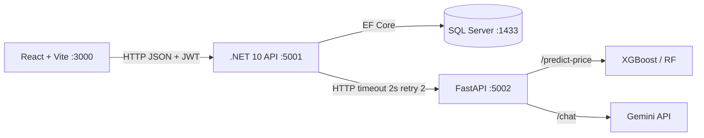

# Kiến trúc hệ thống — Car Rental AI

> Tài liệu chốt tuần 1. Mọi thay đổi phải qua Pull Request + ADR mới.
> Phiên bản: 1.1 — 09/2026

## 1. Ba tầng kiến trúc

| Tầng | Câu hỏi | Trả lời của đồ án |
|---|---|---|
| Code architecture | Code tổ chức thế nào trong .NET? | **Clean Architecture + Modular Monolith** |
| System architecture | Hệ thống gồm những service nào? | **Client-Server** |
| Integration architecture | .NET gọi AI bằng gì? | **Request-Response (HTTP sync)** |

Ánh xạ với ảnh tổng quan kiến trúc: **1.2 Clean/Onion + 2.4 Client-Server (bên trong 2.2) + 3.1 Request-Response**.

## 2. System architecture — Client-Server



| Thành phần | Port | Tech | Phụ trách |
|---|---|---|---|
| Frontend | 3000 | React + Vite | Lê Việt Anh |
| Backend .NET | 5001 | .NET 10, Clean Architecture, Modular Monolith | Nguyễn Vũ Dũng + Đỗ Anh Tuấn |
| AI Service | 5002 | FastAPI, XGBoost/RF, Gemini | Nguyễn Minh Năng |
| Database | 1433 | SQL Server | Nguyễn Vũ Dũng |
| DevOps | — | Docker Compose, GitHub Actions | Vũ Duy Tiến |

> Lưu ý: Backend .NET là **MỘT khối deploy duy nhất (monolith)** nhưng bên trong chia module rõ (mục 4). AI Service là **service độc lập ngoài monolith** để scale riêng phần AI — đây là điểm khác biệt khi phản biện.

## 3. Integration architecture (.NET ↔ AI) — ĐÃ CHỐT

- **Cơ chế:** HTTP request-response đồng bộ.
- **Timeout:** 2 giây, **Retry:** 2 lần.
- **Fallback:** AI lỗi/timeout → trả `Car.BasePricePerDay`, flag `isFallback: true`.
- **Correlation ID:** header `X-Correlation-Id`.
- **Không dùng** RabbitMQ/Kafka, MassTransit/Wolverine (chỉ có nghĩa với bất đồng bộ).

## 4. Code architecture — Clean Architecture + Modular Monolith (.NET 10)

Backend là Modular Monolith đặt trong khung Clean Architecture (5 project). Quy tắc phụ thuộc: Domain không tham chiếu gì.

```
CarRental.sln
├── src/CarRental.Domain          → KHÔNG tham chiếu gì
├── src/CarRental.Application     → chỉ tham chiếu Domain
├── src/CarRental.Infrastructure  → tham chiếu Application
├── src/CarRental.API             → tham chiếu Application + Infrastructure
└── tests/CarRental.Tests
```

Tổ chức theo module nghiệp vụ (chỉ là quy ước đặt folder, không đổi kiến trúc):

```
src/CarRental.Domain/
├── Modules/Cars/          # Car, CarImage
├── Modules/Bookings/      # Booking, Payment, ReturnRecord
├── Modules/Customers/     # Customer
└── Common/                # BaseEntity, Enums

src/CarRental.Application/
├── Modules/Cars/
├── Modules/Bookings/
└── Modules/Customers/
```

## 5. Quy tắc giá

```
FinalPricePerDay = COALESCE(OverridePrice, PredictedPrice, Car.BasePricePerDay)
Chặn [400.000đ, 1.500.000đ] / ngày
```

## 6. Bảo mật & Liên kết

- JWT cho mọi endpoint trừ `/api/auth/*`. Secret qua `.env` và GitHub Secrets.
- Chi tiết endpoint: [api-contract.md](api-contract.md) · ERD: [erd.dbml](erd.dbml) · Quyết định: [decisions.md](decisions.md)