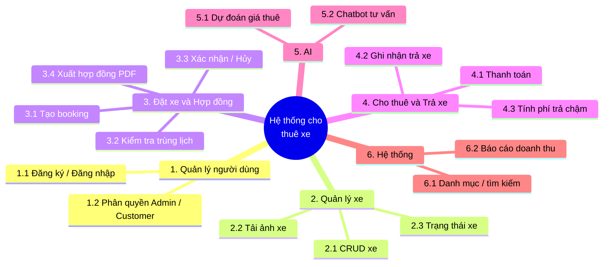

# Tài liệu quyết định kiến trúc & phân rã chức năng

> Đồ án: Hệ thống Cho thuê Xe Thông minh — Tối ưu Giá thuê & Tư vấn Đặt xe bằng AI
> Người viết: Nguyễn Vũ Dũng (nhóm trưởng) · Phiên bản: 1.1 · Cập nhật: 09/2026
> Mọi thay đổi kiến trúc phải qua Pull Request + ADR mới.

---

# PHẦN A — TẠI SAO CHỌN KIẾN TRÚC NÀY

Ánh xạ với khung 3 cột kiến trúc phần mềm:

| Cột | Lựa chọn của đồ án | Không chọn |
|---|---|---|
| 1. Tổ chức mã nguồn | **1.2 Clean / Onion / Hexagonal** | 1.1 Layered N-Tier, 1.3 Vertical Slice |
| 2. Kiến trúc hệ thống | **2.4 Client-Server**, backend bên trong là **2.2 Modular Monolith** | 2.1 Monolith thuần, 2.3 Microservices |
| 3. Giao tiếp / tích hợp | **3.1 Request-Response (HTTP sync)** | 3.2 Event-Driven, 3.3 Queue, 3.4 Pub/Sub |

Nhãn ngắn khi thuyết trình: **Clean Architecture, Modular Monolith**.

---

## ADR-001: Clean Architecture kết hợp Modular Monolith cho backend .NET

**Quyết định:** Solution chia 5 project theo Clean Architecture (Domain / Application / Infrastructure / API / Tests). Bên trong Domain và Application, code được tổ chức theo **module nghiệp vụ** (Cars, Bookings, Customers) — đây là Modular Monolith: một khối deploy duy nhất nhưng chia module rõ.

**Tại sao chọn:**

1. **Tách nghiệp vụ khỏi công nghệ.** Rule cốt lõi (quy tắc giá, kiểm tra trùng lịch thuê, tính phí trả chậm) nằm trong Domain, không dính SQL Server hay HTTP. Đổi database hoặc thêm endpoint không phải sửa nghiệp vụ.
2. **Đúng yêu cầu môn học.** Giám khảo cần thấy code tổ chức chuẩn, không "mì ăn liền" (controller gọi thẳng DbContext).
3. **5 người code song song không giẫm nhau.** Tuấn làm Application/Domain, Năng chỉ chạm API client sang AI service, Tiến lo Docker — mỗi người một tầng, ít conflict khi merge.
4. **Test được.** `CarRental.Tests` kiểm tra rule nghiệp vụ trực tiếp, không cần khởi động web server hay database.
5. **Modular Monolith đủ cho quy mô đồ án.** Vẫn là một ứng dụng .NET duy nhất khi deploy (một image Docker, một process :5001), nhưng folder chia theo Cars / Bookings / Customers nên dễ phân công và dễ mở rộng sau này mà không phải tách microservice.

**Cấu trúc folder (quy ước, không đổi kiến trúc tổng thể):**

```
src/CarRental.Domain/
├── Modules/Cars/          # Car, CarImage
├── Modules/Bookings/      # Booking, Payment, ReturnRecord
├── Modules/Customers/     # Customer
└── Common/                # BaseEntity, Enums

src/CarRental.Application/
├── Modules/Cars/
├── Modules/Bookings/
└── Modules/Customers/
```

Quy tắc phụ thuộc: Domain không tham chiếu gì. Application chỉ tham chiếu Domain. Infrastructure tham chiếu Application. API là composition root.

**Phương án loại:**

- *Layered N-Tier (1.1):* vẫn tách được Presentation / Business / Data nhưng không cưỡng chế được quy tắc — một dòng `using Microsoft.EntityFrameworkCore` lạc chỗ trong Domain là đổ. Clean Arch biến quy tắc thành ràng buộc compile-time.
- *Vertical Slice (1.3):* hợp DDD theo feature, thừa với 5 người / 10 tuần.
- *Microservices cho toàn bộ (2.3):* mỗi service một DB riêng, cần API Gateway, giám sát, mạng nội bộ — quá thừa. Chỉ AI Service là tách thật (ADR-002).

---

## ADR-002: Tách AI Service thành process riêng (FastAPI), không nhúng vào .NET

**Quyết định:** .NET API :5001 (Modular Monolith) và AI Service :5002 (FastAPI) chạy độc lập, giao tiếp qua HTTP. AI không nằm trong monolith.

**Tại sao chọn:**

1. **Hệ sinh thái ML chỉ có ở Python.** XGBoost, scikit-learn RandomForest, pandas, Gemini SDK — hệ thư viện chuẩn ngành đều là Python. Training trong .NET (ML.NET) mất thời gian mà không có công cụ phân tích dữ liệu tương đương.
2. **Năng (phụ trách AI) code Python độc lập**, không cần dựng .NET; Tuấn code .NET không cần cài Python. Ranh giới là 2 endpoint đã contract hóa.
3. **Lỗi AI không sập hệ thống.** AI service chết thì .NET vẫn chạy, tự fallback giá niêm yết (ADR-003).
4. **Scale riêng phần AI** nếu inference nặng — đây là điểm khác biệt khi phản biện, không phải điểm yếu.

**Phương án loại:** nhúng model vào .NET bằng ML.NET — bị loại vì giới hạn thư viện ML và tách khỏi dòng chảy MLOps thực tế.

---

## ADR-003: .NET ↔ AI giao tiếp HTTP đồng bộ, KHÔNG dùng message queue

**Quyết định:** .NET gọi thẳng FastAPI qua HTTP, timeout 2 giây, retry 2 lần, quá thì fallback giá niêm yết + flag `isFallback: true`. Không RabbitMQ/Kafka, không MassTransit/Wolverine.

**Tại sao chọn:**

1. **Bản chất nghiệp vụ là đồng bộ.** Khách bấm "Xem giá đề xuất" thì phải thấy giá ngay trong 1 lần chờ. Queue chỉ có nghĩa khi chấp nhận "gửi lệnh, nhận kết quả sau" — bài toán này không có khâu đó.
2. **Độ trễ yêu cầu thấp:** AI chỉ cần suy đoán giá, không cần hàng phút.
3. **Không thêm hạ tầng phải vận hành.** RabbitMQ = thêm container broker, thêm cấu hình, thêm lỗi để giải quyết — trong 10 tuần với 5 sinh viên, đó là rủi ro lớn hơn lợi ích.
4. **Fallback lo được phần "AI chết":** timeout 2s bắt buộc, response luôn có giá để UI hiển thị.

**Phương án loại:**

- *MassTransit / Wolverine + RabbitMQ (3.2, 3.3, 3.4):* thiết kế cho bất đồng bộ/pub-sub — không khớp bài toán; over-engineering, thầy có thể hỏi "queue giải quyết vấn đề gì ở đây?".
- *gRPC:* nhanh hơn về lý thuyết nhưng thêm bước dựng protobuf, không đáng cho 2 endpoint JSON nhỏ.
- *MediatR:* không phải lựa chọn hạ tầng, chỉ là quy ước code trong Application layer → không bắt buộc.

---

## ADR-004: React + Vite cho frontend; SQL Server cho database

**Quyết định:** Frontend là React SPA :3000 gọi API :5001 bằng JWT. Database dùng SQL Server. Đây là **Client-Server (2.4)** ở tầm hệ thống — không phải Monolith thuần (2.1).

**Tại sao không ghi 2.1 Monolith:**

Monolith (2.1) nghĩa là UI + business + data gom trong **một process deploy duy nhất**. Đồ án có React chạy riêng :3000, .NET API riêng :5001, FastAPI riêng :5002, SQL Server riêng :1433 — 4 process. Đó đúng định nghĩa Client-Server. Ghi 2.1 sẽ bị hỏi: React chạy ở đâu trong monolith? AI Python nhúng vào .NET thế nào?

**Tại sao chọn React + SQL Server:**

React thống nhất TypeScript với team, Vite khởi động nhanh, SPA tách rõ frontend/backend đúng tinh thần DevOps (2 image riêng). SQL Server đồng bộ hệ Microsoft của đề tài, DBML mô hình hóa trước rồi sinh migration.

---

## ADR-005: Docker Compose + GitHub Actions

**Quyết định:** Toàn bộ 4 service (FE, API, AI, SQL Server) dựng bằng 1 file `docker-compose.yml`. CI build + test mỗi Pull Request. Branch `main` và `develop` bắt buộc PR + 1 approval.

**Tại sao:** Triệt tiêu lỗi "máy em chạy được mà". CI bắt lỗi sớm, mỗi PR xanh mới được merge.

---

# PHẦN B — PHÂN RÃ CHỨC NĂNG & MÔ TẢ NGHIỆP VỤ

## B.1 Sơ đồ phân rã chức năng



## B.2 Mô tả từng chức năng

### 1. Quản lý người dùng

Khách đăng ký bằng CCCD (định danh khi nhận xe), đăng nhập lấy JWT. **Admin** quản lý xe, booking, doanh thu. **Customer** chỉ đặt xe của chính mình. Ràng buộc: CCCD và số điện thoại duy nhất trong hệ thống.

### 2. Quản lý xe

Admin thêm / sửa / xóa xe, mỗi xe nhiều ảnh, mô tả. Giá niêm yết `BasePricePerDay` là sàn khi AI lỗi. Trạng thái xe: Available / Booked / Renting / Maintenance — chỉ xe `Available` mới nhận booking.

### 3. Đặt xe và Hợp đồng — chức năng trung tâm

1. Khách chọn xe + ngày lấy + ngày trả, tùy chọn nhận giá AI đề xuất.
2. Hệ thống kiểm tra trùng lịch: không tồn tại booking nào của xe đó đang `Pending / Confirmed / Active` mà dải ngày `[Start; ReturnDate)` giao với dải xin đặt. Nếu trùng → `409 BOOKING_OVERLAP`.
3. Booking tạo ra ở `Pending`, hết hạn tự `Expired` nếu quá giờ chờ xác nhận.
4. Khách xác nhận + đặt cọc → `Confirmed`. Hệ thống sinh hợp đồng điện tử PDF (thông tin khách, xe, giá chốt, phạt chậm trả).
5. Khách có thể `Cancel` (ghi lý do). Có thể mất cọc theo chính sách nếu đã đến hạn.

### 4. Cho thuê và Thanh toán

Khi nhận xe, hợp đồng có hiệu lực, booking → `Active`. Một booking thanh toán nhiều lần (cọc + phần còn lại + phí phát sinh). Mỗi Payment có trạng thái `Pending / Paid / Failed / Refunded` (thanh toán giả lập cho đồ án).

Khi trả xe, hệ thống so sánh thời điểm trả thực tế với hạn dự kiến: trả trễ → tính `lateFee`; trả đúng hạn → booking `Completed`, xe về `Available`.

### 5. AI — điểm khác biệt của đồ án

- **5.1 Dự đoán giá:** input (loại xe, số chỗ, mùa cao điểm, thời hạn thuê, ngày cuối tuần, nhu cầu) → XGBoost / Random Forest trả giá/ngày.
  `FinalPricePerDay = COALESCE(OverridePrice, PredictedPrice, BasePricePerDay)`, chặn [400.000đ – 1.500.000đ]/ngày.
- **5.2 Chatbot tư vấn:** Gemini + ngữ cảnh danh mục xe và booking của khách → gợi ý xe phù hợp, khách chốt luôn từ hội thoại.

### 6. Chức năng hệ thống

Danh mục thương hiệu / loại xe, tìm kiếm filter (giá, số chỗ, hộp số, nhiên liệu), báo cáo doanh thu Admin (booking theo tháng, doanh thu theo xe, tỷ lệ lấp đầy).

## B.3 Luồng nghiệp vụ tổng quát (happy path)

```
Khách đăng nhập
  → tìm xe (Available)
  → xem giá AI đề xuất (hoặc giá niêm yết nếu fallback)
  → đặt xe
  → hệ thống check trùng lịch
  → Pending
  → xác nhận + cọc → Confirmed
  → hợp đồng PDF
  → nhận xe → Active
  → trả xe → tính phí phát sinh → Completed
  → thanh toán đủ → Paid
```

Xe quay về `Available`, lịch được giải phóng cho booking kế tiếp.
